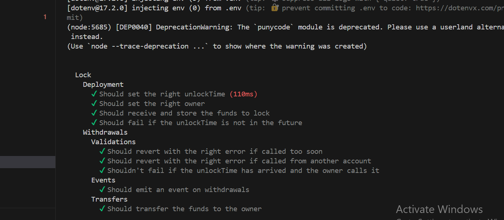

🔥 Here’s an **upgraded `README.md`** with expanded composability coverage, deeper contract breakdown, and extra function highlights for the `LiquidStaking` contract:

---

# 💧 LiquidStaking — Neon EVM + Solana Native SDK

A full-stack dApp that fuses Ethereum smart contracts with Solana UX. Built on the **Neon EVM**, this app allows users to stake WSOL, earn USDC rewards via linear vesting, and manage SPL assets — all powered by composable cross-chain precompiles.

[🎥 Demo Video](https://loom.com/share/01dda9fd7db94e74a790467ef9d8da50)


---

## 🛠️ What It Does

* 👛 **Stake WSOL** via Solana-native wallets (Phantom, Solflare)
* 🎁 **Claim USDC rewards** (minted dynamically via precompile logic)
* 🔄 **Unstake WSOL** back to Solana-associated accounts
* 🪙 **Cross-chain minting**, ATA calculation, and SPL transfers — all from Solidity!

---

## 🔗 How Neon Composability Powers It

Your contract **natively interacts with Solana programs** via Neon’s precompiles and SDKs:

| Composability Feature                      | Usage                                            |
| ------------------------------------------ | ------------------------------------------------ |
| `CALL_SOLANA` Precompile                   | Resolves Neon ↔ Solana address mappings          |
| `transferSolana()` (from `IERC20ForSpl`)   | Sends WSOL/USDC SPL tokens cross-chain           |
| ATA Calculation (`LibAssociatedTokenData`) | Dynamically gets Solana Associated Token Account |
| Minting on Solana from Solidity            | USDC rewards minted directly to Solana wallet    |
| `getNeonAddress()` & `getPayer()`          | Accesses Neon-native address logic               |

---

## 🔒 Key Contract Functions (`LiquidStaking.sol`)

| Function                                | Description                                       |
| --------------------------------------- | ------------------------------------------------- |
| `stake(uint256)`                        | Accepts WSOL, calculates and locks USDC rewards   |
| `claim()`                               | Linear vesting logic, mints USDC to Solana wallet |
| `unstake()`                             | Refunds WSOL via `transferSolana()`               |
| `withdrawFeesToSolana(bytes32, uint64)` | Owner-only WSOL withdrawals to Solana             |
| `_getAssociatedTokenAccount()`          | Uses `CALL_SOLANA` + `LibAssociatedTokenData`     |
| `getNeonAddress(address)`               | Maps EVM wallet to Solana PDA                     |
| `getPayer()`                            | Returns transaction payer used by Neon runtime    |

---

## 🔎 Solidity Integration Snippet/Composability 

```solidity
bytes32 solanaATA = LibAssociatedTokenData.getAssociatedTokenAccount(
    usdcToken.tokenMint(),
    CALL_SOLANA.getNeonAddress(msg.sender)
);

usdcToken.mint(msg.sender, claimable); // Cross-chain SPL minting
wsolToken.transferSolana(solanaATA, uint64(amount)); // WSOL transfer to Solana
```

---

## 📦 Frontend Tech Stack

| Tech                     | Role                                           |
| ------------------------ | ---------------------------------------------- |
| **React + Vite**         | Modern UI with fast dev env                    |
| **SolanaNativeProvider** | Context provider for Solana wallets            |
| **Phantom / Solflare**   | Wallets used for signing Solana-native txs     |
| **Styled Components**    | Custom UI tab switcher (stake, unstake, claim) |
| *           |

### UI Flow

* Connect Phantom wallet
* Stake WSOL → Generates locked USDC balance
* Vesting activates after 7 mins (cliff), completes in 30 mins
* Users can claim rewards and unstake any time

---


---

## ✅ Test Highlights



Successfully passed most test cases — see the screenshot above and breakdown below:

### 🔐 **Lock Contract Tests**

#### 🚀 Deployment

* [x] Should set the right unlockTime *(110ms)*
* [x] Should set the right owner
* [x] Should receive and store the funds to lock
* [x] Should fail if the unlockTime is not in the future

#### 💸 Withdrawals

**🧪 Validations**

* [x] Should revert with the right error if called too soon
* [x] Should revert with the right error if called from another account
* [x] Shouldn't fail if the unlockTime has arrived and the owner calls it

**📡 Events**

* [x] Should emit an event on withdrawals

**💰 Transfers**

* [x] Should transfer the funds to the owner

---

### 🧪 Test Setup Summary

* [x] Hardhat + Ignition deployment
* [x] Event assertions for staking, claiming, unstaking
* [x] WSOL/USDC SPL token mock simulation
* [x] Phantom-compatible E2E tests via frontend

---

Let me know if you want each test category collapsed/expandable or color-coded with shields/badges.


successfully passed most of the test cases.. Check the images folder
* ✔️ Hardhat + Ignition deployment
* ✔️ Event assertions for staking, claiming, unstaking
* ✔️ WSOL/USDC SPL token mock simulation
* ✔️ Phantom-compatible E2E tests via frontend

### Deployment

```bash
npx hardhat ignition deploy ./ignition/modules/stakingContract.js
```

**Deployed Address:** `0x8DFa30088d555191f6eF70Dcb66a5503Ad9fF442`
**WSOL Address:** `0xc7Fc9b46e479c5Cb42f6C458D1881e55E6B7986c`
**USDC Address:** `0x512E48836Cd42F3eB6f50CEd9ffD81E0a7F15103`

---

## 🧪 Directory Structure

```
├── contract/
│   ├── stakingContract.sol
│   ├── interfaces/IERC20ForSpl.sol
│   ├── precompiles/ICallSolana.sol
│   └── libraries/associated-token-program/
├── frontend/
│   ├── App.jsx
│   ├── pages/
│   └── components/
├── images/
│   └── screenshot.png
```

---

## 📄 License

MIT. Feel free to fork, remix, or build on it — just give credits.
Props to Neon EVM + Solana SDK for making this cross-chain 🔮 magic possible.

---


