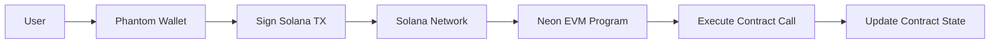

# 🚀 Solana Native SDK Liquid Staking

This implementation uses the **Solana Native SDK** approach from Neon EVM, allowing users to connect with **Solana wallets** (Phantom, Solflare) and interact with **Neon EVM contracts** through **scheduled transactions**.

## 🎯 What's Different

- ❌ **No MetaMask** required
- ✅ **Solana wallets** (Phantom, Solflare) 
- ✅ **Scheduled transactions** from Solana to Neon EVM
- ✅ **Cross-chain magic** - Solana UX + Ethereum contracts

## 📋 Prerequisites

1. **Deployed Neon EVM Contract** - Your existing `LiquidStaking.sol` contract deployed on Neon EVM
2. **Solana Wallet** - Phantom or Solflare browser extension
3. **SOL for fees** - Small amount of SOL for transaction fees

## ⚙️ Setup Instructions

### 1. Install Dependencies

```bash
cd frontend/frontend-staking
npm install
# or
yarn install
```

### 2. Configure Contract Addresses

Edit `src/config/neonConfig.js`:

```javascript
CONTRACTS: {
  // UPDATE THESE WITH YOUR DEPLOYED CONTRACT ADDRESSES
  LIQUID_STAKING: '0xYOUR_CONTRACT_ADDRESS_HERE',
  WSOL_TOKEN: '0xWSOL_TOKEN_ADDRESS_HERE',
  USDT_TOKEN: '0xUSDT_TOKEN_ADDRESS_HERE'
}
```

### 3. Run the Application

```bash
npm run dev
# or
yarn dev
```

### 4. Connect Your Solana Wallet

1. Install [Phantom](https://phantom.app/) or [Solflare](https://solflare.com/)
2. Create/import your Solana wallet
3. Get some devnet SOL from [Solana faucet](https://faucet.solana.com/)
4. Click "Connect Solana Wallet" in the app

## 🔧 How It Works

### The Magic Behind Solana Native SDK

1. **User connects Solana wallet** (Phantom/Solflare)
2. **App creates Neon EVM address** from Solana public key
3. **User signs Solana transactions** that execute Neon EVM contract calls
4. **Scheduled execution** happens on Neon EVM
5. **Cross-chain state** is maintained automatically

### Transaction Flow



## 🏗️ Architecture

### Components Structure

```
src/
├── components/
│   ├── SolanaNativeProvider.jsx    # Main SDK provider
│   ├── SolanaHeader.jsx           # Wallet connection UI
│   └── SolanaWalletProvider.jsx   # (old - unused)
├── pages/
│   ├── SolanaStake.jsx           # Staking interface
│   ├── SolanaUnstake.jsx         # Unstaking interface
│   └── SolanaWithdraw.jsx        # Rewards claiming
├── config/
│   └── neonConfig.js             # Contract addresses & config
└── App.jsx                       # Main application
```

### Key Features

- **🔗 Dual Address Display** - Shows both Solana and derived Neon EVM addresses
- **📊 Real-time Balances** - SOL balance updates automatically
- **🎨 Beautiful UI** - Modern design with gradients and animations
- **📱 Responsive** - Works on mobile and desktop
- **⚡ Fast Transactions** - Solana speed with Ethereum compatibility

## 🚀 Deployment

### For Development
```bash
npm run dev
```

### For Production
```bash
npm run build
npm run preview
```

### Deploy to Vercel/Netlify
```bash
# Build the project
npm run build

# Deploy dist/ folder to your hosting provider
```

## 🔧 Configuration Options

### Network Settings

Switch between devnet and mainnet in `neonConfig.js`:

```javascript
// For development
CURRENT_NETWORK: 'DEVNET',

// For production  
CURRENT_NETWORK: 'MAINNET',
```

### Staking Parameters

Adjust staking rules to match your contract:

```javascript
STAKING: {
  MIN_STAKE: 0.1,     // Minimum stake amount
  MAX_STAKE: 1.0,     // Maximum stake amount
  STAKE_MULTIPLE: 0.1, // Must be multiple of this
  TOKENS_PER_STAKE: 0.1, // Reward ratio
  VESTING_PERIOD: 30 * 60, // 30 minutes
  VESTING_CLIFF: 7 * 60    // 7 minutes
}
```

## 🐛 Troubleshooting

### Common Issues

1. **"Please install Phantom wallet"**
   - Install Phantom browser extension
   - Refresh the page

2. **"Contract not configured"**
   - Update contract addresses in `neonConfig.js`
   - Make sure addresses are correct

3. **"Transaction failed"**
   - Check SOL balance for fees
   - Verify contract is deployed
   - Check network connection

4. **"No stake found"**
   - Make sure you've staked first
   - Check the correct Neon EVM address is being used

### Debug Mode

Enable console logging by opening browser dev tools. The app logs detailed transaction information.

## 🎯 Next Steps

### Enhancements You Can Add

1. **Token Swapping** - Integrate Raydium/Orca for WSOL acquisition
2. **NFT Rewards** - Mint NFTs for long-term stakers  
3. **Analytics Dashboard** - Track staking metrics
4. **Mobile App** - React Native version
5. **Multi-token Support** - Support other SPL tokens

### Integration Ideas

- **Jupiter Protocol** - Token swapping
- **Marinade Finance** - Liquid staking integration
- **Metaplex** - NFT marketplace integration
- **Serum DEX** - Advanced trading features

## 📚 Resources

- [Neon EVM Docs](https://neonevm.org/docs)
- [Solana Native SDK Guide](https://neonevm.org/docs/composability/sdk_solana_native)
- [Phantom Wallet Integration](https://docs.phantom.app/)
- [Solana Web3.js](https://solana-labs.github.io/solana-web3.js/)

## 🤝 Support

Need help? Check out:
- [Neon EVM Discord](https://discord.gg/neonevm)
- [Solana Developer Resources](https://solana.com/developers)
- [GitHub Issues](../../../issues)

---

**🎉 Congratulations!** You now have a fully functional Solana Native SDK liquid staking app that works without MetaMask! 